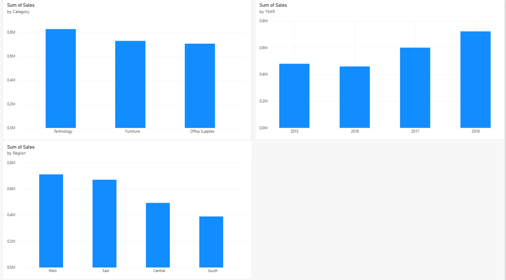

# Superstore Sales Analysis

Dự án nhỏ mình làm để luyện SQL + Python, dùng bộ dữ liệu Superstore Sales trên
Kaggle. Mục tiêu là trả lời vài câu hỏi kinh doanh cơ bản: danh mục nào bán chạy,
khu vực nào yếu, doanh thu qua các năm thế nào.

## Công cụ
- Python (pandas, matplotlib, sqlite3)
- SQL chạy qua SQLite (đọc CSV bằng pandas rồi đẩy vào SQLite để query)

## 1. Danh mục nào bán chạy nhất?

```sql
SELECT Category, SUM(Sales), COUNT(*), AVG(Sales)
FROM sales
GROUP BY Category
```

| Category | Doanh thu | Số đơn | TB/đơn |
|---|---|---|---|
| Furniture | 728,658.58 | 2,078 | 350.65 |
| Office Supplies | 705,422.33 | 5,909 | 119.38 |
| Technology | 827,455.87 | 1,813 | 456.40 |


Technology doanh thu cao nhất dù số đơn ít nhất — vì giá trị mỗi đơn cao hơn hẳn
(456 so với 119-350 của 2 nhóm còn lại). Ngược lại Office Supplies bán nhiều đơn
nhưng mỗi đơn giá trị thấp, kiểu văn phòng phẩm mua lặt vặt thường xuyên.

## 2. Khu vực nào ổn, khu vực nào yếu?

```sql
SELECT Region, SUM(Sales)
FROM sales
GROUP BY Region
ORDER BY SUM(Sales) DESC
```

| Region | Doanh thu |
|---|---|
| West | 710,219.68 |
| East | 669,518.73 |
| Central | 492,646.91 |
| South | 389,151.46 |


West cao nhất, South thấp nhất, chênh nhau khoảng 321k — gần gấp đôi. Đây là chỗ
nếu làm thật sẽ đào sâu thêm (dân số khu vực, số cửa hàng, v.v.) nhưng trong phạm
vi dữ liệu này chỉ dừng ở mức nhận ra sự chênh lệch.

## 3. Doanh thu qua các năm thế nào?

```sql
SELECT Year, SUM(Sales), COUNT(*), AVG(Sales), MIN(Sales), MAX(Sales)
FROM sales
GROUP BY Year
ORDER BY Year DESC
```

| Year | Doanh thu | Số đơn | TB/đơn | Min | Max |
|---|---|---|---|---|---|
| 2015 | 479,856.21 | 1,953 | 245.70 | 0.852 | 22,638.48 |
| 2016 | 459,436.01 | 2,055 | 223.57 | 0.984 | 6,354.95 |
| 2017 | 600,192.55 | 2,534 | 236.86 | 0.836 | 17,499.95 |
| 2018 | 722,052.02 | 3,258 | 221.62 | 0.444 | 13,999.96 |


2015 sang 2016 giảm nhẹ, sau đó tăng đều tới 2018. Có một điểm hơi lạ: 2015 có
ít đơn nhất nhưng trung bình mỗi đơn lại cao nhất — chủ yếu do có 1 đơn hàng
"khủng" (22,638) kéo trung bình lên, chứ không hẳn năm đó khách mua sang hơn.
Số lượng đơn thì tăng đều qua từng năm, cái đó hợp lý hơn để nhìn xu hướng thật.

## 4. Power BI Dashboard

Ngoài phân tích bằng SQL/Python ở trên, mình làm thêm bản dashboard tương tác
trên Power BI từ cùng bộ dữ liệu, để luyện thêm công cụ BI thay vì chỉ code.



Dùng DAX để tạo cột Year từ Order Date, sau đó dựng 3 biểu đồ y hệt phần
phân tích SQL ở trên (Category, Region, Year). Điểm khác là dashboard này
có thể tương tác được — bấm vào 1 phần của biểu đồ sẽ tự lọc các biểu đồ
còn lại (cross-filtering), khác với biểu đồ tĩnh của Matplotlib.

File gốc: `superstore_sales_dashboard.pbix` (cần cài Power BI Desktop để mở).

## Chạy thử
1. `pip install pandas matplotlib`
2. Tải dataset `train.csv` từ Superstore Sales Dataset (Kaggle)
3. Sửa đường dẫn ở dòng `pd.read_csv(...)` trong notebook cho đúng chỗ bạn để file
4. Chạy notebook `superstore_sales_da.ipynb`
