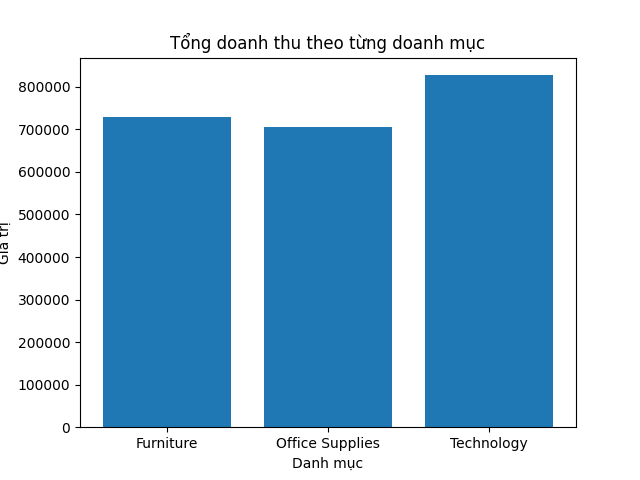
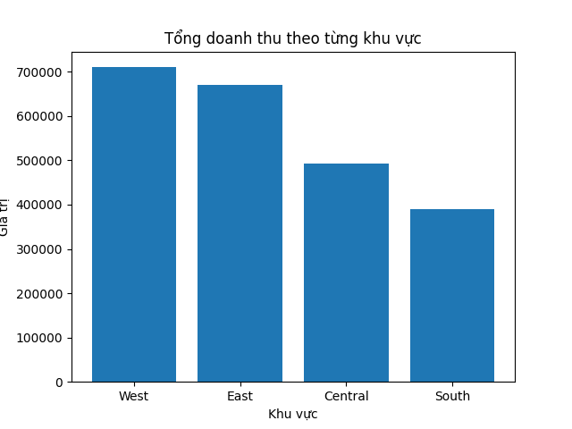
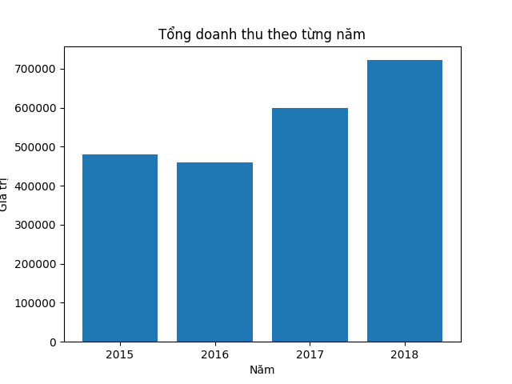

# Phân tích dữ liệu bán hàng (Superstore Sales Analysis)

## Giới thiệu
Dự án phân tích dữ liệu bán hàng thực tế từ bộ dữ liệu **Superstore Sales Dataset** (Kaggle),
nhằm trả lời các câu hỏi kinh doanh về doanh thu theo danh mục sản phẩm, khu vực địa lý,
và xu hướng theo thời gian. Dự án kết hợp SQL (truy vấn, tổng hợp dữ liệu) và Python
(xử lý dữ liệu, trực quan hóa) — mô phỏng quy trình phân tích dữ liệu thực tế của một
Data Analyst.

## Công cụ sử dụng
- Python (pandas, matplotlib)
- SQL (SQLite) — truy vấn và tổng hợp dữ liệu
- Google Colab

## Cách triển khai
Dữ liệu CSV được đọc bằng `pandas`, sau đó nạp vào một cơ sở dữ liệu SQLite để có thể
viết và chạy các câu truy vấn SQL thật (`SELECT`, `GROUP BY`, `ORDER BY`, các hàm tổng
hợp `SUM`, `COUNT`, `AVG`, `MIN`, `MAX`). Kết quả truy vấn được trực quan hóa bằng
Matplotlib để dễ dàng quan sát và phân tích.

## Phân tích 1: Doanh thu và số lượng đơn hàng theo Danh mục (Category)

**Câu hỏi:** Danh mục sản phẩm nào mang lại doanh thu cao nhất? Vì sao?

```sql
SELECT Category, SUM(Sales), COUNT(*), AVG(Sales)
FROM sales
GROUP BY Category
```

| Category | Tổng doanh thu | Số đơn hàng | Giá trị TB/đơn |
|---|---|---|---|
| Furniture | 728,658.58 | 2,078 | 350.65 |
| Office Supplies | 705,422.33 | 5,909 | 119.38 |
| Technology | 827,455.87 | 1,813 | 456.40 |



**Nhận xét:** Dữ liệu cho thấy sự khác biệt rõ rệt giữa các danh mục: Office Supplies
có số lượng đơn hàng nhiều nhất (5,909 đơn) nhưng giá trị trung bình mỗi đơn thấp nhất
(119.38) — phù hợp với đặc điểm của văn phòng phẩm là sản phẩm giá trị thấp, mua thường
xuyên. Ngược lại, Technology có số đơn ít nhất (1,813 đơn) nhưng giá trị trung bình mỗi
đơn cao nhất (456.40) — phản ánh đặc tính sản phẩm công nghệ thường có giá trị cao hơn.
Nhờ vậy, dù số đơn ít, Technology vẫn đóng góp doanh thu tổng cao nhất trong 3 danh mục.

## Phân tích 2: Doanh thu theo Khu vực (Region)

**Câu hỏi:** Khu vực nào có doanh thu cao nhất/thấp nhất? Chênh lệch lớn đến mức nào?

```sql
SELECT Region, SUM(Sales)
FROM sales
GROUP BY Region
ORDER BY SUM(Sales) DESC
```

| Region | Tổng doanh thu |
|---|---|
| West | 710,219.68 |
| East | 669,518.73 |
| Central | 492,646.91 |
| South | 389,151.46 |



**Nhận xét:** West là khu vực có doanh thu cao nhất (710,219.68), trong khi South có
doanh thu thấp nhất (389,151.46) — chênh lệch giữa 2 khu vực này lên tới 321,068.23,
cho thấy sự mất cân đối đáng kể về hiệu quả kinh doanh giữa các khu vực.

## Phân tích 3: Xu hướng doanh thu theo Năm (Year)

**Câu hỏi:** Doanh thu biến động ra sao qua các năm?

```sql
SELECT Year, SUM(Sales), COUNT(*), AVG(Sales), MIN(Sales), MAX(Sales)
FROM sales
GROUP BY Year
ORDER BY Year DESC
```

| Year | Tổng doanh thu | Số đơn hàng | TB/đơn | Min | Max |
|---|---|---|---|---|---|
| 2015 | 479,856.21 | 1,953 | 245.70 | 0.852 | 22,638.48 |
| 2016 | 459,436.01 | 2,055 | 223.57 | 0.984 | 6,354.95 |
| 2017 | 600,192.55 | 2,534 | 236.86 | 0.836 | 17,499.95 |
| 2018 | 722,052.02 | 3,258 | 221.62 | 0.444 | 13,999.96 |



**Nhận xét:** Tổng doanh thu có xu hướng giảm nhẹ từ 2015 sang 2016, sau đó tăng liên
tục và mạnh mẽ từ 2016 đến 2018. Đáng chú ý, dù có số lượng đơn hàng ít nhất (1,953
đơn), năm 2015 lại có giá trị trung bình mỗi đơn cao nhất (245.70) — có thể do ảnh
hưởng từ đơn hàng lớn nhất trong cả 4 năm (22,638.48), một "outlier" (giá trị ngoại
lai) kéo mức trung bình lên cao. Ngược lại, số lượng đơn hàng tăng liên tục qua từng
năm (từ 1,953 lên 3,258), cho thấy nhu cầu mua sắm ngày càng mở rộng theo thời gian.

## Kết luận chung
Dự án cho thấy khả năng khai thác dữ liệu bán hàng thực tế bằng SQL kết hợp Python để
trả lời các câu hỏi kinh doanh cụ thể: xác định danh mục/khu vực trọng điểm, phát hiện
sự mất cân đối giữa các khu vực, và nhận diện xu hướng tăng trưởng theo thời gian —
đây là các kỹ năng phân tích cốt lõi của một Data Analyst.

## Cách chạy
1. Cài đặt thư viện: `pip install pandas matplotlib`
2. Tải bộ dữ liệu **Superstore Sales Dataset** từ Kaggle (file `train.csv`)
3. Trong file `superstore_sales_da.ipynb`, sửa lại đường dẫn đọc file CSV ở dòng
   `pd.read_csv(...)` cho khớp với vị trí bạn lưu file trên máy/Google Drive của mình
4. Chạy toàn bộ notebook trên Jupyter Notebook hoặc Google Colab
